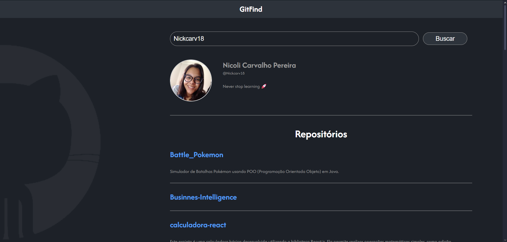

# Git Find

## 📃Descrição

Este projeto é uma aplicação React que permite pesquisar por usuários do GitHub e exibir suas informações, como nome, bio e repositórios. A aplicação interage com a API do GitHub para buscar os dados em tempo real.

## 🚀 Tecnologias Utilizadas

- **React.js**: Biblioteca JavaScript para construção de interfaces de usuário.
- **HTML, CSS:** Linguagens padrão para estrutura e estilização de páginas web.
- **JavaScript:** Linguagem de programação para lógica e interação com o DOM.
- **API do GitHub:** Interface de programação para acessar dados públicos do GitHub.

## 🚧 Pré-requisitos

- **Node.js e npm (ou yarn)**: Certifique-se de ter o Node.js e o gerenciador de pacotes npm (ou yarn) instalados em seu sistema.
- **Um editor de código:** Visual Studio Code, Sublime Text, Atom, etc.

## 📥 Instalação

1. Clone o repositório: `git clone https://github.com/Nickcarv18/git-find`
2. Acesse a pasta do projeto: `cd git-find`
3. Instale as dependências: `npm install`

## 💻 Execução

1. Inicie o servidor de desenvolvimento: `npm start`

- A aplicação será aberta em seu navegador padrão, geralmente em <http://localhost:3000>.

## 📌 Funcionalidades

- **Busca de usuários**: Permite pesquisar por qualquer usuário do GitHub.
- **Exibição de informações do usuário**:  Mostra o avatar, nome, bio e login do usuário pesquisado.
- **Lista de repositórios**: Exibe uma lista com os nomes e descrições dos repositórios do usuário.

## 🔧 Estrutura do Código

    git-find/
    ├── node_modules/
    ├── public/
    │   └── index.html
    ├── src/
    │   ├── assets/
    │   │   └── background.png
    │   ├── components/
    │   │   ├── Button/
    │   │   ├── Header/
    │   │   ├── Input/
    │   │   └── ItemList/
    │   ├── pages/
    │   │   └── Home/
    │   ├── styles.css
    │   ├── .gitignore
    │   ├── package-lock.json
    │   ├── package.json
    │   └── README.md

- **components**: Contém componentes reutilizáveis como `Header`, `Button` e `ItemList`.
- **pages**: Contém as páginas da aplicação, no caso, a página `Home`.
- **styles.css**: Arquivo de estilo global.
- **assets**: Contém arquivos de imagem e outros recursos estáticos.

## 🖌️ Layout

Você pode visualizar o layout do projeto através [desse link](https://www.figma.com/design/IXySq1eGSvvY9nSGLbKcom/GitFind?node-id=2-2&node-type=frame&t=utWwb7p0O2LTpsih-0). É necessário ter conta no [Figma](https://figma.com/) para acessá-lo.
